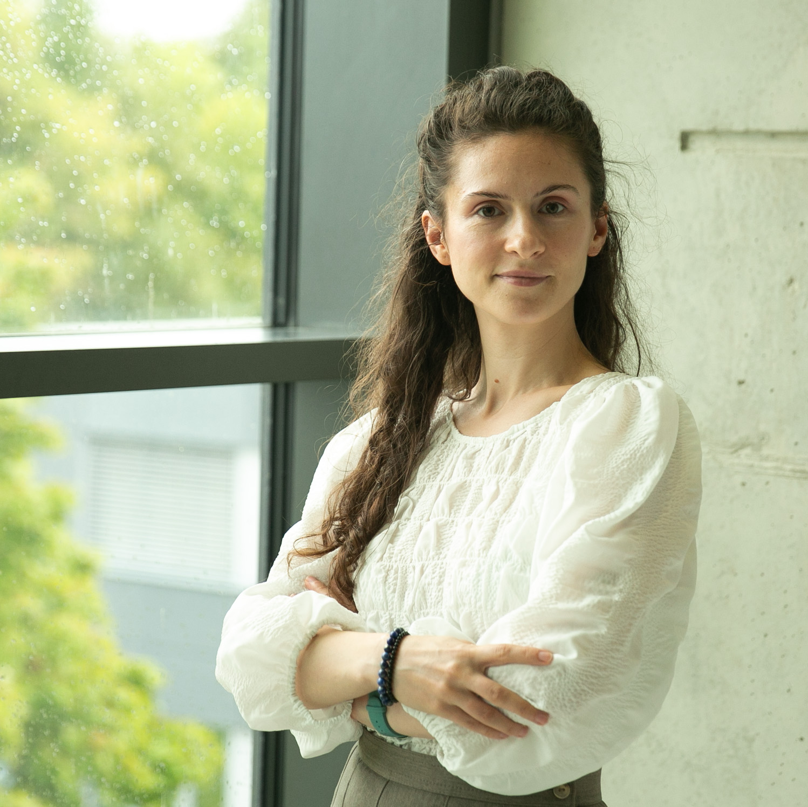

# 👋 Hello! I'm Silvia Cazacu  (Silvia is spelled with two 'i's, not 'yi') 📚 and Cazacu is pronounced 'Kah-zah-koo'). Welcome!

  <!-- Profile Image Section -->
  

    
  

  <!-- Contact Info Section -->
  

    

      ## 📬 Contact  
      📧 email [silvia[dot]cazacu-bucica[at]kuleuven[dot]be]  
      💼 [LinkedIn](https://linkedin.com/in/silvia-cazacu/)
    

  

---

## ✨ PhD Researcher at KU Leuven, Belgium, within the [Spatial Applications Division Leuven](https://ees.kuleuven.be/en/sadl/about-sadl) & Marie Curie Early Stage Researcher with [ODECO](https://odeco-research.eu/)

**Ongoing reflections**
- 🤲 exposing the 'hands that touch the data' (to cite data feminist scholars Cathrine D’Ignazio and Lauren F. Klein) through data physicalisation
- ⚖️ (ac)counting for power dynamics in data/model/technology design 
- 🏗️ infrastructuring as ongoing data practice

---

## 🛠️ Recent work

- 📄 [**Disentangling Power Dynamics in Participatory Data Physicalisation**] (https://doi.org/10.1145/3706598.3713703) Silvia Cazacu, Georgia Panagiotidou, Thérèse Steenberghen, and Andrew Vande Moere.  In Conference on Human Factors in Computing Systems (CHI ’25), April 26-May 1, 2025, Yokohama, Japan. ACM, New York,
NY, USA, 19 pages.

---

## 🗞️ Something's cooking

- **April 2025** – 🎉 Presenting "Disentangling Power Dynamics in Participatory Data Physicalisation" at [CHI2025](
- **May 2025** - Organising, presenting, discussing 

---

Thanks for visiting! 🧡
