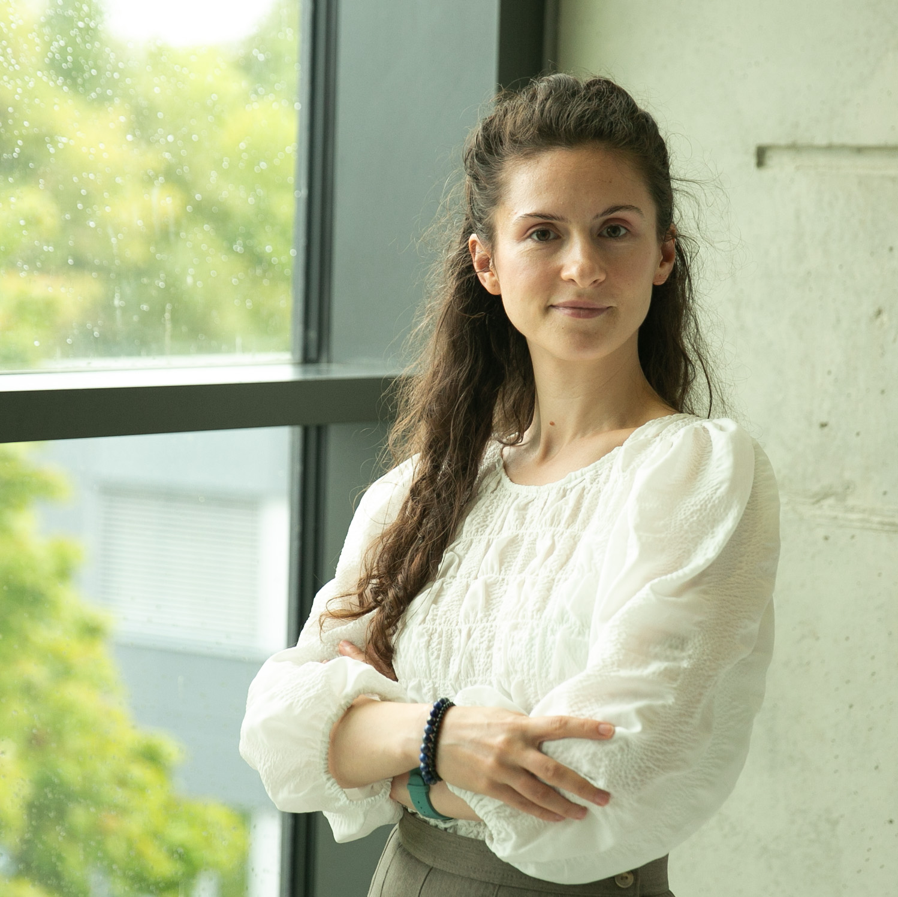

# Hello! I'm Silvia Cazacu 
📝*spell Silvia with two 'i's, not 'y-i' & pronounce Cazacu as 'Kah-zah-koo'. TY!* 

**Postdoc Researcher at Télécom Paris, Institut Polytechnique de Paris [DIVA group](hhttps://diva.telecom-paristech.fr/)**

**[former] PhD Researcher at KU Leuven [SADL](https://ees.kuleuven.be/en/sadl/) |
Marie Curie Early Stage Researcher at [ODECO](https://odeco-research.eu/) |
and Research fellow at [The Open Data Institute](https://theodi.org/about-the-odi/the-odi-team/odi-fellows/)**

## 🧩 Things on my mind recently

- Co-organizing the CHI26 workshop on Responsible AI: [HCI-TERRA: HCI Towards EnviRonmentally Responsible AI](https://hci-terra.github.io/)
- Exploring new intersections of Power x Design x HCI... do you have an idea you'd like to explore with me?

## ✨ Recent Work

- **[Revealing the Power Dynamics of Collaborative Sense-Making supported by Participatory Data Physicalization](https://programs.sigchi.org/chi/2026/program/content/222840)** Silvia Cazacu, Georgia Panagiotidou and Andrew Vande Moere. *ACM Conference on Human Factors in Computing Systems (CHI ’26)*. [HAL](https://hal.science/hal-05549548) 
- **[Infrastructuring Critical Data Literacy through Role-playing: a Retrospective Study of the Game "Datopolis"](https://dl.acm.org/doi/10.1145/3757615)** Silvia Cazacu, Elena Simperl, Gefion Thuermer, Joe Massey, Thérèse Steenberghen, Georgia Panagiotidou and Andrew Vande Moere. *ACM Conference on Human Factors in Computing Systems (CHI ’26)*. [arxiv](https://arxiv.org/abs/2503.13018)
- **[Disentangling the Power Dynamics in Participatory Data Physicalisation](https://dl.acm.org/doi/10.1145/3706598.3713703)** Silvia Cazacu, Georgia Panagiotidou, Thérèse Steenberghen, and Andrew Vande Moere. *ACM Conference on Human Factors in Computing Systems (CHI ’25)*. [arxiv](https://arxiv.org/abs/2503.13018)
- **[The EnviroMapper Toolkit: An Input Physicalisation that Captures the Situated Experience of Environmental Comfort in Offices](https://programs.sigchi.org/chi/2025/program/content/194718)** Silvia Cazacu, Stien Poncelet, Emma Feijtraij, and Andrew Vande Moere.*In Extended
Abstracts of the ACM Conference on Human Factors in Computing Systems (CHI EA'25)*. [arxiv](https://arxiv.org/abs/2503.17257)

## 🍳 News

- April 2026 - My final PhD thesis chapter received an Honorable Mention at CHI26; this brings the total of chapters awarded at CHI to two!
  
- April 2026 - I practiced my CHI26 talk for [Revealing the Power Dynamics of Collaborative Sense-Making supported by Participatory Data Physicalization](https://programs.sigchi.org/chi/2026/program/content/222840) at [Paris Pre-CHI](https://sites.google.com/view/paris-pre-chi26/home).

- March 2026 - going back to KU Leuven after my PhD defence to teach DataVis for Digital Humanities (taking over the lectures of prof. Andrew Vande Moere during his sabbatical).

- February 2026 - moving to Paris 🚗! to start a post-doc with Nathalie Bressa and Samuel Huron on Collective Deliberation x Data Physicalization.

- January 2026 - I defended my PhD after exactly 4 years since I started my academic journey at KU Leuven! Yay! So grateful to my supervisors, mentors, collaborators, co-authors, participants, lab colleagues, friends and family for supporting me during this time.

- November 2025 - I travelled to Norway for CSCW25 to present our retrospective analysis with players of Datopolis, the ODI-designed boardgame that teaches data infrastructure literacy to organizations.

- October 2025 - I submitted my PhD thesis 'Towards Critical Data Infrastructures: Revealing Power Dynamics in Participatory Data Practices through Data Physicalisation Design', available upon request on [Limo](https://kuleuven.limo.libis.be/discovery/fulldisplay?docid=lirias4388686&context=SearchWebhook&vid=32KUL_KUL:Lirias&lang=en&search_scope=lirias_profile&adaptor=SearchWebhook&tab=LIRIAS&query=any,contains,LIRIAS4388686&offset=0). Or email me, I'll send you a copy :)

 
 🦄 *Thanks for visiting!*
